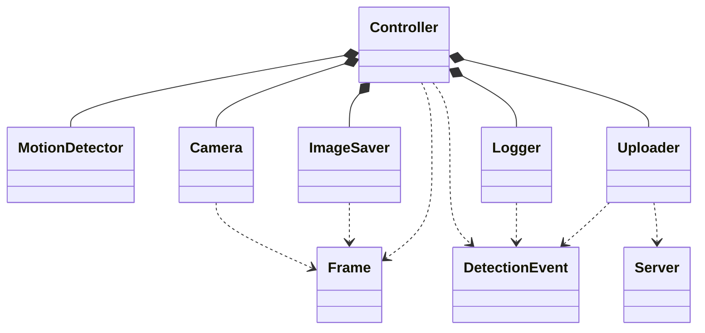
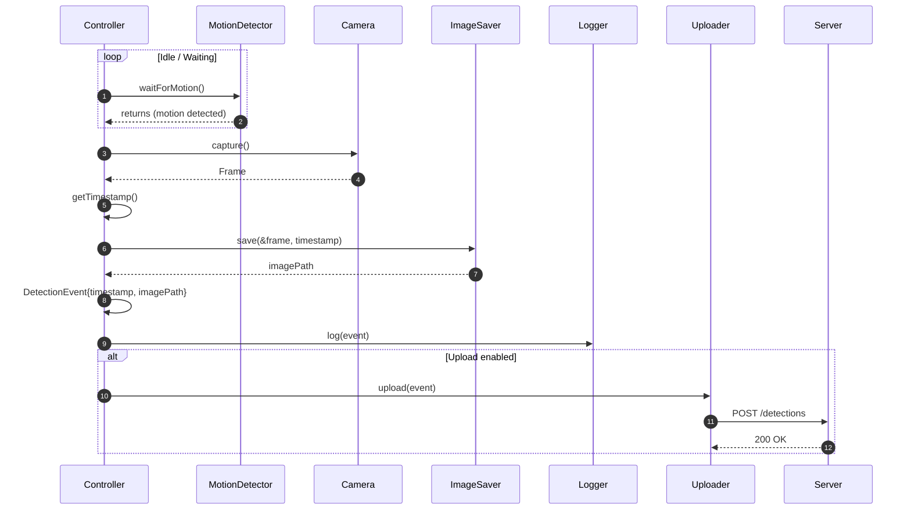

## Class 

```mermaid
classDiagram

    class Controller
    class MotionDetector
    class Camera
    class ImageSaver
    class Logger
    class Uploader
    class Server
    class Frame
    class DetectionEvent

    %% Composition
    Controller *-- MotionDetector
    Controller *-- Camera
    Controller *-- ImageSaver
    Controller *-- Logger
    Controller *-- Uploader

    %% Data flow / usage
    Camera ..> Frame
    ImageSaver ..> Frame
    Controller ..> Frame
    Controller ..> DetectionEvent
    Logger ..> DetectionEvent
    Uploader ..> DetectionEvent

    %% Dependency
    Uploader ..> Server


```

## Detection Sequence

```mermaid
sequenceDiagram
    autonumber

    participant Controller
    participant MotionDetector
    participant Camera
    participant ImageSaver
    participant Logger
    participant Uploader
    participant Server

    loop Idle / Waiting
        Controller ->> MotionDetector: waitForMotion()
        MotionDetector -->> Controller: returns (motion detected)
    end

    Controller ->> Camera: capture()
    Camera -->> Controller: Frame

    Controller ->> Controller: getTimestamp()

    Controller ->> ImageSaver: save(&frame, timestamp)
    ImageSaver -->> Controller: imagePath

    Controller ->> Controller: DetectionEvent{timestamp, imagePath}

    Controller ->> Logger: log(event)

    alt Upload enabled
        Controller ->> Uploader: upload(event)
        Uploader ->> Server: POST /detections
        Server -->> Uploader: 200 OK
    end

```
