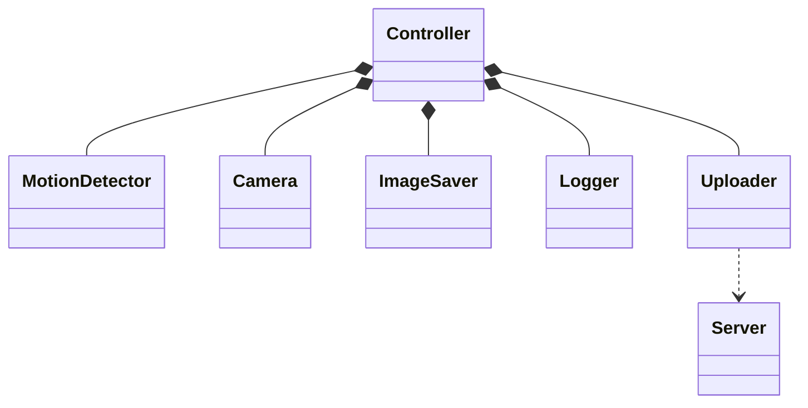
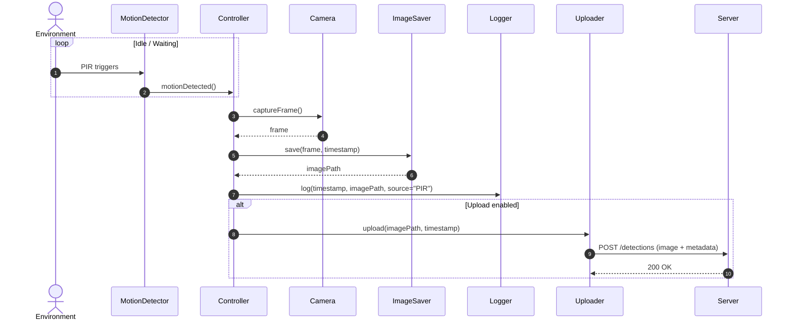

## Class 

```mermaid
classDiagram

    class Controller
    class MotionDetector
    class Camera
    class ImageSaver
    class Logger
    class Uploader
    class Server

    %% Composition (filled diamond in UML)
    Controller *-- MotionDetector
    Controller *-- Camera
    Controller *-- ImageSaver
    Controller *-- Logger
    Controller *-- Uploader

    %% Dependency (dashed arrow)
    Uploader ..> Server
```

## Detection Sequence

```mermaid
sequenceDiagram
    autonumber

    actor Environment

    participant MotionDetector
    participant Controller
    participant Camera
    participant ImageSaver
    participant Logger
    participant Uploader
    participant Server

    loop Idle / Waiting
        Environment ->> MotionDetector: PIR triggers
        MotionDetector ->> Controller: motionDetected()
    end

    Controller ->> Camera: captureFrame()
    Camera -->> Controller: frame

    Controller ->> ImageSaver: save(frame, timestamp)
    ImageSaver -->> Controller: imagePath

    Controller ->> Logger: log(timestamp, imagePath, source="PIR")

    alt Upload enabled
        Controller ->> Uploader: upload(imagePath, timestamp)
        Uploader ->> Server: POST /detections (image + metadata)
        Server -->> Uploader: 200 OK
    end
```